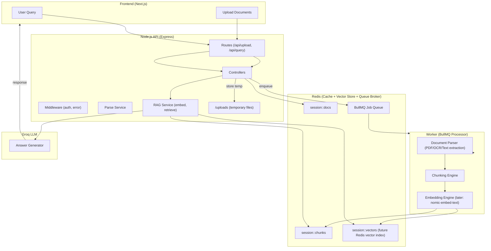

## System overview 



## To run (dependency and working document @apps/api)

frontend: cd apps/web
```npm run dev```

backend: start API by cd apps/api
```npm run dev```

in another terminal in the api start worker:
```node src/jobs/processor.job.js```

verify redis: 
```docker exec -it clause-redis redis-cli ping```

to start docker: 
```docker-compose up -d```

for embed_server (go to embed_server cd): 
```uvicorn app:app --host 0.0.0.0 --port 8000```


## Documentation

### Features

- **Multi-format document ingestion**
  - Upload PDFs and DOCX files from the Next.js web UI.
  - Background parsing of text and structured content (including styled HTML for DOCX previews).
  - Per-session and per-document storage so you can work on multiple matters independently.

- **Document-centric RAG chat**
  - Ask natural-language questions about a selected document or the entire session.
  - Retrieval-Augmented Generation (RAG): finds the most relevant chunks before calling the LLM.
  - Answers include **citations** (doc + chunk IDs) and the UI exposes clickable citations to jump to the source and copy the reference.

- **Vector store over Redis**
  - Parsed text is chunked into overlapping segments.
  - Each chunk is embedded into a vector and stored in Redis under `session:<id>:doc:<docId>:chunks`.
  - Session-level semantic search over all chunks to pick the best document and answer context.

- **Hybrid LLM backends**
  - Cloud LLM support (originally Groq/OpenAI-compatible chat completions).
  - Local LLM via **Ollama** (`llama3.2:latest`) for offline / no-rate-limit development.
  - A single `callLLM` helper that:
    - Detects local-vs-cloud.
    - Talks to Ollama’s `/api/generate` streaming NDJSON.
    - Or standard chat APIs (`model` + `messages`) for cloud providers.

- **Pluggable embedding pipeline**
  - Embedding mode switchable via env:
    - `EMBEDDING_MODE=local` → Python `embed_server` (FastAPI) using a local model.
    - `EMBEDDING_MODE=cloud` → HTTP embedding API (Groq/OpenAI style).
  - Chunked embeddings are cached in Redis with TTL for fast re-use across queries.

- **Async parsing + job queue**
  - File uploads enqueue parse jobs onto a BullMQ queue.
  - A Node worker process:
    - Downloads the file from disk.
    - Runs type-specific parsers (PDF, DOCX, text, basic image placeholder).
    - Writes parsed text + metadata + chunks/embeddings back to Redis.
  - Frontend can start asking questions while parsing continues in the background; responses degrade gracefully until vectors are ready.

- **Rich document viewer**
  - Split-view chat and document preview.
  - Toggle between:
    - Raw document (iframe-based viewer for PDF/HTML).
    - Parsed text view.
  - Scroll-position preservation for parsed HTML (DOCX) so navigation feels smooth.

- **Session + document management**
  - Each browser session maps to a `sessionId` stored in Redis.
  - Multiple documents per session with previews, sizes, MIME types, and parsed status.
  - TTL-based cleanup to avoid unbounded growth; optional retention of uploaded files via `KEEP_UPLOADS`.

- **Developer ergonomics**
  - Dockerized Redis Stack (Redis + RediSearch / vector support) and RedisInsight UI.
  - Clear `.env` configuration for RAG, embeddings, and LLMs.
  - Embed server isolated as a Python app with its own `requirements.txt` and quickstart instructions.

---

### Technologies Used

- **Frontend**
  - **Next.js (App Router)** – React-based UI, routing, and API integration.
  - **TypeScript** – Typed components and app logic.
  - **Tailwind CSS / custom CSS** – Layout and styling.
  - Browser APIs for clipboard, hash-based navigation, and iframes.

- **Backend (API)**
  - **Node.js + Express** – HTTP API, routing (`/api/upload`, `/api/chat`, etc.).
  - **BullMQ** – Job queue for asynchronous parsing and embedding.
  - **Redis (Redis Stack)** – 
    - Key/value cache for parsed text and metadata.
    - Vector storage (embeddings per chunk).
    - Queue broker for BullMQ.
  - **Parsing libraries**:
    - `pdf-parse` (dynamic import) for PDF text extraction.
    - `mammoth` for DOCX → text + HTML.
    - Fallback direct text read for `.txt` and other plaintext types.
  - **node-fetch / undici** – HTTP client for talking to LLMs and embedding services.
  - **Custom services**:
    - `parse.service.js` – File-type detection, extraction pipeline, and metadata shaping.
    - `vector.service.js` – Chunking, embedding calls, Redis storage and search.
    - `chat.service.js` – RAG orchestration, LLM calling, and fallback logic.

- **Worker / Jobs**
  - **Node BullMQ worker** (`processor.job.js`) – 
    - Consumes parse jobs from Redis queues.
    - Orchestrates parsing → chunking → embedding → Redis writes.
    - Logs progress and errors via a shared logger.

- **Embeddings**
  - **Python FastAPI embed server** (`embed_server/app.py`) –
    - HTTP `/embed` endpoint that accepts text batches.
    - Uses a local embedding model (e.g., sentence-transformers) on CPU/GPU.
  - **Cloud embedding APIs** (Groq / OpenAI-compatible) –
    - `EMBEDDING_API_URL`, `EMBEDDING_API_KEY`, `EMBEDDING_MODEL`.
  - Chunking strategy:
    - Configurable `CHUNK_SIZE` and `CHUNK_OVERLAP` via env.
    - Simple sliding window over text tokens/characters.

- **LLMs**
  - **Groq / OpenAI-style chat APIs** (initial implementation).
  - **Ollama** for local generation:
    - HTTP `POST /api/generate` with `model` + `prompt`.
    - Streaming NDJSON parsed and concatenated by `callLLM`.

- **Infrastructure / Tooling**
  - **Docker Compose** – Redis Stack + RedisInsight.
  - **RedisInsight** – Browser-based Redis inspector for debugging sessions, docs, and chunks.
  - **ESLint / TypeScript configs** – Code quality and type checking.
  - **Git** – Version control, branch-based feature development.

---

### Methodology

- **End-to-end RAG pipeline**
  1. **Ingest** – User uploads a document; API stores the file and enqueues a parse job.
  2. **Parse** – Worker detects file type and extracts text (and DOCX HTML for preview).
  3. **Chunk** – Parsed text is split into overlapping chunks according to `CHUNK_SIZE` and `CHUNK_OVERLAP`.
  4. **Embed** – Each chunk is turned into a vector via:
     - Local Python `embed_server` (when `EMBEDDING_MODE=local`), or
     - Cloud embeddings (when `EMBEDDING_MODE=cloud`).
  5. **Store** – Chunks + embeddings + metadata are written into Redis under session/doc keys with TTL.
  6. **Retrieve** – For each question, the backend:
     - Runs semantic search across all session chunks.
     - Aggregates scores per document to pick the best `pickedDocId`.
     - Builds a textual context out of the top-ranked chunks.
  7. **Generate** – `chat.service`:
     - Crafts a hybrid prompt (system + user) that:
       - Prefers document context as primary truth.
       - Allows general knowledge with an explicit disclaimer when context is insufficient.
     - Calls the configured LLM (Ollama or cloud) via `callLLM`.
     - Returns the answer with structured citations (`session:<id>:doc:<docId>#chunk:<chunkId>`).
  8. **Present** – Frontend:
     - Renders answers as chat messages.
     - Shows citation chips that can:
       - Open the associated document in the viewer.
       - Copy the citation string to the clipboard.

- **Graceful degradation / fallbacks**
  - If vector search fails or embeddings aren’t ready:
    - Fall back to raw parsed text from Redis for best-effort answers.
  - If LLM is misconfigured, rate-limited, or unreachable:
    - Return a concise snippet-based answer from the top chunk(s).
    - Keep logging detailed errors server-side, but preserve UX.

- **Config-driven behavior**
  - Behavior is controlled via environment variables (`.env` in `apps/api/src`):
    - RAG tuning: `CHUNK_SIZE`, `CHUNK_OVERLAP`, `VECTOR_INDEX`, `VECTOR_DIM`.
    - Embeddings: `EMBEDDING_MODE`, `EMBEDDING_LOCAL_URL`, `EMBEDDING_API_URL`, `EMBEDDING_API_KEY`.
    - LLM: `LLM_API_URL`, `LLM_MODEL`, `LLM_API_KEY`.
    - Redis: host/port/TTL for parsed content and embeddings.
  - This makes it easy to switch between:
    - Pure local (Ollama + local embeddings).
    - Hybrid (local embeddings + cloud LLM).
    - Full cloud (cloud embeddings + cloud LLM).

- **Developer-first design**
  - Clear separation of concerns:
    - Controllers vs services vs jobs vs utilities.
  - Minimal assumptions about providers:
    - `callLLM` and `embedBatch` normalize different API shapes so the rest of the app doesn’t care whether it’s Groq, OpenAI, or Ollama.
  - Everything debuggable:
    - Redis keys readable in RedisInsight.
    - Logs include `sessionId`, `docId`, and error messages for quick tracing.


## Getting Started

First, run the development server:

```bash
npm run dev
# or
yarn dev
# or
pnpm dev
# or
bun dev
```

Open [http://localhost:3000](http://localhost:3000) with your browser to see the result.

You can start editing the page by modifying `app/page.tsx`. The page auto-updates as you edit the file.

This project uses [`next/font`](https://nextjs.org/docs/app/building-your-application/optimizing/fonts) to automatically optimize and load [Geist](https://vercel.com/font), a new font family for Vercel.

## Learn More

To learn more about Next.js, take a look at the following resources:

- [Next.js Documentation](https://nextjs.org/docs) - learn about Next.js features and API.
- [Learn Next.js](https://nextjs.org/learn) - an interactive Next.js tutorial.

You can check out [the Next.js GitHub repository](https://github.com/vercel/next.js) - your feedback and contributions are welcome!

## Deploy on Vercel

The easiest way to deploy your Next.js app is to use the [Vercel Platform](https://vercel.com/new?utm_medium=default-template&filter=next.js&utm_source=create-next-app&utm_campaign=create-next-app-readme) from the creators of Next.js.

Check out our [Next.js deployment documentation](https://nextjs.org/docs/app/building-your-application/deploying) for more details.
