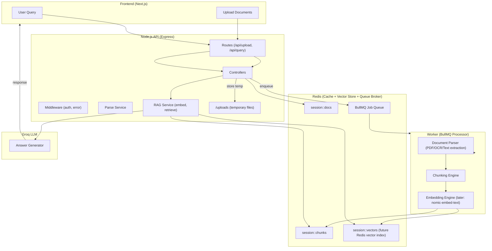

# Clause Genie — API

## Quick start (dev)
1. `cd apps/api`
2. copy `.env` from example and edit
3. `npm install`
4. Start Redis locally: `redis-server` (or use Docker)
5. Start API: `npm run dev`
6. Start worker: `node src/jobs/processor.job.js`

## Requirements

System:
- Node.js (v18+ recommended, this repo uses Node 22 in CI/dev)
- Redis (server) running locally or reachable remotely (default host `127.0.0.1`, port `6379`)

Installable packages (from `apps/api/package.json`):
- `express` - web framework
- `dotenv` - load environment variables from `.env`
- `cors` - CORS helper
- `multer` - multipart file uploads
- `pdf-parse` - PDF text extraction (CommonJS module)
- `mammoth` - DOCX -> text extraction
- `redis` - Redis client
- `bullmq` - background job queue (requires Redis)
- `morgan` - HTTP request logging middleware
- `pino` - structured logger
- `uuid` - ID generation for sessions/docs

Dev / optional packages:
- `nodemon` - automatic restart in dev
- `pino-pretty` (optional) - pretty-print logs when `USE_PINO_PRETTY=1`

Suggested install (from `apps/api`):
```bash
cd apps/api
npm install
```

Start Redis (examples):
- Homebrew (macOS):
    ```bash
    brew install redis
    brew services start redis
    redis-cli ping # should reply PONG
    ```
- Docker:
    ```bash
    docker run -d --name clause-genie-redis -p 6379:6379 redis:7
    docker exec -it clause-genie-redis redis-cli ping
    ```

Notes:
- `pdf-parse` is a CommonJS package — the worker uses `createRequire` in ESM files to import it.
- OCR for images is not implemented by default; if you need OCR consider installing `tesseract` or `tesseract.js` and adding an OCR step to the worker.
- If you enable pretty logging locally, install `pino-pretty` and run with `USE_PINO_PRETTY=1`.

Parsed data storage (metadata & text)
- Metadata key: `session:<sessionId>:doc:<docId>:meta` (Redis hash, contains fields like `docId`, `originalname`, `size`, `mimetype`, `uploadedAt`, `parsedAt`, `status`, `preview`).
- Text key: `session:<sessionId>:doc:<docId>:text` (string containing the extracted text).
- TTL: Both metadata and extracted text are set to expire after `PARSED_TTL_SECONDS` seconds. By default this value is 24 hours (86400 seconds). To change it, set `PARSED_TTL_SECONDS` in your `apps/api/.env`.

Example: check a parsed doc in Redis
```bash
# list keys for a session
redis-cli KEYS "session:<your-session-id>:doc:*:meta"

# view metadata hash
redis-cli HGETALL "session:<your-session-id>:doc:<doc-id>:meta"

# view text and TTL
redis-cli GET "session:<your-session-id>:doc:<doc-id>:text"
redis-cli TTL "session:<your-session-id>:doc:<doc-id>:text"
```


Endpoints:
- `GET /api/health` - health
- `POST /api/upload` - multipart upload (field name `files[]`)

config/         Environment setup, app level constants
controllers/    Business logic per route (upload, query, etc)
routes/         Defines API endpoints and connects to controllers
services/       Core processing (parse, embed, vectorize, etc)
jobs/           Background worker queue (BullMQ)
middleware/     Global middleware (auth, error handler)
utils/          Logger, Redis connection, reusable helpers
uploads/        Temporary local file storage



