# Clause Genie — API

## Quick start (dev)
1. `cd apps/api`
2. copy `.env` from example and edit
3. `npm install`
4. Start Redis locally: `redis-server` (or use Docker)
5. Start API: `npm run dev`
6. Start worker: `node src/jobs/processor.job.js`

Endpoints:
- `GET /api/health` - health
- `POST /api/upload` - multipart upload (field name `files[]`)

config/         Environment setup, app level constants
controllers/    Business logic per route (upload, query, etc)
routes/         Defines API endpoints and connects to controllers
services/       Core processing (parse, embed, vectorize, etc)
jobs/           Background worker queue (BullMQ)
middleware/     Global middleware (auth, error handler)
utils/          Logger, Redis connection, reusable helpers
uploads/        Temporary local file storage

```mermaid
flowchart TB

    %% ========= CLIENT ========= %%
    subgraph CLIENT["🟦 Frontend (Next.js)"]
        UDF["📤 Upload Documents"]
        UQ["❓ User Query"]
    end

    %% ========= API SERVER ========= %%
    subgraph API["🟩 Node.js API (Express)"]
        direction TB

        RTE["🔗 Routes (/api/upload, /api/query)"]
        CTR["🧭 Controllers"]
        MDW["🛡 Middleware (auth, error)"]

        SRV_PARSE["🧩 Parse Service"]
        SRV_RAG["🤖 RAG Service (embed, retrieve)"]

        UPLOAD_DIR["📁 /uploads (temporary files)"]
    end

    %% ========= REDIS ========= %%
    subgraph REDIS["🟥 Redis (Cache + Vector Store + Queue Broker)"]
        RS1["📝 session:<id>:docs"]
        RS2["📚 session:<id>:chunks"]
        RS3["🔢 session:<id>:vectors (future Redis vector index)"]
        QUEUE["📦 BullMQ Job Queue"]
    end

    %% ========= WORKER ========= %%
    subgraph WORKER["🟪 Worker (BullMQ Processor)"]
        JOB_PARSE["📜 Document Parser (PDF/OCR/Text extraction)"]
        JOB_CHUNK["✂️ Chunking Engine"]
        JOB_EMB["🧠 Embedding Engine (later: nomic-embed-text)"]
    end

    %% ========= LLM ========= %%
    subgraph LLM["🟧 Groq LLM"]
        GEN["🧠 Answer Generator"]
    end



    %% -------- FLOWS -------- %%

    %% Upload Flow
    UDF --> RTE
    RTE --> CTR
    CTR -->|store temp| UPLOAD_DIR
    CTR -->|enqueue| QUEUE

    QUEUE --> WORKER
    WORKER --> JOB_PARSE
    JOB_PARSE --> JOB_CHUNK
    JOB_CHUNK --> JOB_EMB

    JOB_EMB --> RS2
    JOB_EMB --> RS3
    CTR --> RS1

    %% Query Flow
    UQ --> RTE --> CTR --> SRV_RAG

    SRV_RAG --> RS3
    SRV_RAG --> RS2

    SRV_RAG --> GEN
    GEN -->|response| CLIENT
```

